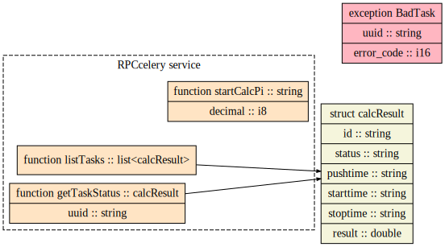

# Демонстрация REST на библиотеке fastapi, обмен сообщениями с highload сервером с помощью apache thrift и асинхронные операции  с помощью библиотеки celery

___

> Выполнен как тестовое задание для собеседования.
>> тестовое задание для питониста бэкера
>> 1. с использованием фремворка fastapi сделать сервис, который возвращает инфу: статистика о работе (тупо нагрузку CPU и свободное место на диске)
>> 2. написать для celery примитивную задачу котора считает число пи, или бином ньютона
>> 3. подобрать такого демонизатора, чтобы в рамках одного контейнера запускать воркера celery и fastapi приложение на uvicorn
>> 4. Дополнен заданием с использованием интерфейса thrift

___

## Как это работает
Для запуска в папке проекта необходимо выполнить `docker-compose build`, соберется проект с двумя контейнерами:
1. Стандартный образ rabbitmq
2. Образ на базе python в котором установятся supervisord для управления двумя установленными приложениями celery и tserver
3. FastAPI с клиентами для tserver для каждой задачи

Затем выполните `docker-compose up`.

После успешного запуска контейнеров запустите браузер:
1. По адресу http://127.0.0.1:8000 будет работать приложение REST на базе fastapi. Тут можно просмотреть в виде json (для формирования технического состояния используются библиотеки psutil и socket):
    - http://127.0.0.1:8000/ общее состояние хоста 
    - http://127.0.0.1:8000/calcpi/{число} постановка задачи для вычисления числа pi методом Лейбница, {число} указывает на количество знаков после запятой. Время выполнения каждой задачи порядка 200-300 секунд (для вычислений, которые происходят быстро используется sleep). В ответ на запрос выдаётся id задачи.
    - http://127.0.0.1:8000/task/{id} выдает текущее состояние задачи, результат или промежуточный результат и времена постановки в очередь, начала вычисления и окончания вычисления.
    - http://127.0.0.1:8000/alltasks выдаёт список всех задач с их текущими состояниями.
2. По адресу http://127.0.0.1:9001 можно посмотреть состояние демонов tserver и celery, их журналы и простейший механизм управления этими демонами.

Подробнее можно почитать и потестировать по адресу http://127.0.0.1:8000/docs

[Просмотреть документацию на IDL thrift](https://htmlpreview.github.io/?https://github.com/mineevburyat/REST_demonstration/blob/master/gen-html/rpcinterface.html)

Блок схема:

## Особенность данной демонстрации

В русскоязычной части интернета плохо проинформировано о возможностях получения результата и текущего состояния задачи исполняемой celery. Обычно задачу отправляют в брокер и информируют пользователя через вьюшку что мол окей задача принята на исполнение.

В официальной документации, в случае необходимости сохранения результата выполенния задачи, как лучшей практикой, указывается на необходимость использовать backend redis, или БД, а так же самописный backend, но смутно сказано как это делать. 

Данный пример показывает один из велосипедов самодельного backend, а именно: сохранение результатов и состояния задачи в файл. Причем для каждой задачи создается отдельный файл, что бы избежать состояние гонки между запущенными tasks. В этом файле храниться текущее состояние и результат выполнения в виде текстового json.

## Полученные знания:
:white_check_mark: Библиотека celery

:white_check_mark: Очереди AMQP

:white_check_mark: Базы данных NoSQL на примере redis

:white_check_mark: Docker и Docker Compose

:white_check_mark: Менеджер процессов supervisord

